# 新疆高考 AI 志愿助手
# 数据库 ER 设计 V1.0

## 0. 文档信息

- **项目名称：** 新疆高考 AI 志愿助手
- **文档名称：** 数据库 ER 设计
- **建议文件名：** `04-database-design.md`
- **版本：** V1.0
- **状态：** Architecture Baseline
- **数据库基线：** MySQL 8.4 LTS
- **字符集：** `utf8mb4`
- **适用阶段：** MVP ～ 初期商业化

### 上游文档

- `01-prd.md`
- `02-xinjiang-business-rules.md`
- `03-system-architecture.md`

### 下游文档

- `05-api-contract.md`
- Flyway Migration
- Java Domain Model
- Mapper / Repository
- Data Pipeline Schema
- Codex Backend Skill
- Codex Database Skill

---

# 1. 数据库设计目标

数据库必须同时支持：

1. 微信用户与手机号身份绑定；
2. 一个账号创建多个考生方案；
3. 2026 文史/理工制度；
4. 2027 “3+1+2”制度；
5. 普通类与单列类；
6. 单列类考试语言路径；
7. 专项资格；
8. 报考范围限制；
9. 年度批次规则；
10. 2027 “院校+专业组”；
11. 院校与专业招生计划；
12. 历年录取数据；
13. 数据版本化；
14. 政策来源追溯；
15. 政策冲突；
16. 冲稳保推荐；
17. 免费三次；
18. 永久会员；
19. AI 独立权益；
20. 微信支付；
21. AI 调用审计；
22. 中文/维吾尔语；
23. 推荐结果完整审计；
24. 数据导入与质量管理；
25. 后台管理。

---

# 2. 核心数据库原则

## 2.1 User 与 Candidate 分离

禁止：

```text
user
├── score
├── rank
├── plan_type
└── subject_track
```

正确：

```text
User
 │
 └── Candidate
       │
       ├── ExamProfile
       ├── EligibilityProfile
       └── PreferenceProfile
```

原因：

- 一个账号可能为自己填报；
- 为子女、兄弟姐妹模拟；
- 创建多套方案；
- 复读后参加下一年度高考。

---

## 2.2 画像采用版本化

禁止直接覆盖旧值：

```text
ExamProfile V1
score = 586
```

更新后应创建：

```text
ExamProfile V2
score = 590
```

RecommendationRun 必须引用实际使用的版本。

---

## 2.3 2026 与 2027 共用数据库，不共用错误模型

2026：

```text
exam_regime = TRADITIONAL_WENLI

subject_track =
LITERATURE_HISTORY
SCIENCE_ENGINEERING
```

2027：

```text
exam_regime = XJ_3_1_2

first_choice_subject =
PHYSICS
HISTORY

second_choice_subjects =
CHEMISTRY
BIOLOGY
POLITICS
GEOGRAPHY
```

禁止试图用一个 `subject_type` 字段表达两套制度。

---

## 2.4 招生计划类型与科类分离

禁止：

```text
exam_type =
普通类
单列类
文科
理科
艺术类
```

正确：

```text
plan_type
subject_track
exam_regime
special_category
```

---

## 2.5 招生计划必须版本化

禁止新数据直接覆盖旧数据。

正确：

```text
DataVersion A
↓
AdmissionPlan A

DataVersion B
↓
AdmissionPlan B

Publish B
↓
B 成为 active
```

历史推荐继续引用 A。

---

## 2.6 推荐结果不可变

成功的 RecommendationRun：

```text
不得 UPDATE 改结果
```

新推荐应创建新 Run。

---

## 2.7 JSON 只用于快照与低检索参数

允许：

```text
snapshot_json
parameters_json
provider_metadata_json
```

禁止把核心业务维度整体塞入 JSON 后依赖程序解析。

---

# 3. 数据库命名规范

## 3.1 表名

统一使用 `snake_case`。

## 3.2 主键

统一：

```text
id BIGINT
```

Java：

```text
Long
```

## 3.3 对外 ID

核心外部对象增加：

```text
public_id CHAR(26)
```

建议采用 ULID。

## 3.4 时间

统一：

```text
DATETIME(3)
```

字段：

```text
created_at
updated_at
```

## 3.5 状态

使用：

```text
VARCHAR(32)
```

或：

```text
VARCHAR(64)
```

存稳定业务 Code。

禁止数据库原生 ENUM。

## 3.6 金额

统一：

```text
DECIMAL(12, 2)
```

禁止 FLOAT / DOUBLE 存金额。

## 3.7 分数

建议：

```text
DECIMAL(7, 2)
```

## 3.8 位次

建议：

```text
BIGINT
```

## 3.9 软删除

不全局滥用 `deleted = 0`。

可软删除：

- 用户自定义方案
- 草稿
- 内容

不软删除：

- 支付交易
- 推荐审计
- 数据版本
- AI 调用记录
- 规则历史

---

# 4. 领域与表清单

## 4.1 Identity Domain

1. `app_user`
2. `user_identity`
3. `user_session`

## 4.2 Candidate Domain

4. `candidate`
5. `candidate_exam_profile`
6. `candidate_subject_selection`
7. `candidate_eligibility_profile`
8. `candidate_eligibility_item`
9. `candidate_preference_profile`
10. `candidate_preference_item`

## 4.3 Policy Domain

11. `policy_source`
12. `policy_document_snapshot`
13. `rule_set`
14. `business_rule`
15. `policy_conflict`
16. `admission_batch`
17. `batch_rule`

## 4.4 Data Governance Domain

18. `data_version`
19. `data_version_source`
20. `import_job`
21. `data_quality_issue`
22. `object_file`

## 4.5 Admission Domain

23. `university`
24. `university_alias`
25. `university_i18n`
26. `major`
27. `major_alias`
28. `major_i18n`
29. `admission_plan`
30. `admission_plan_group`
31. `admission_plan_item`
32. `major_subject_requirement`
33. `program_constraint`
34. `control_score_line`
35. `admission_history`

## 4.6 Recommendation Domain

36. `recommendation_request`
37. `recommendation_run`
38. `recommendation_result_item`
39. `recommendation_rule_trace`
40. `recommendation_run_snapshot`

## 4.7 Membership Domain

41. `entitlement_definition`
42. `membership`
43. `membership_entitlement`
44. `quota_account`
45. `quota_ledger`

## 4.8 Commerce Domain

46. `product_sku`
47. `sales_order`
48. `sales_order_item`
49. `payment_record`
50. `payment_notification`
51. `refund_record`

## 4.9 AI Domain

52. `ai_provider`
53. `ai_model`
54. `prompt_template`
55. `prompt_version`
56. `ai_call_log`

## 4.10 Content Domain

57. `content_article`
58. `content_article_i18n`
59. `feedback`

## 4.11 Async / Admin / Audit

60. `async_task`
61. `admin_user`
62. `admin_role`
63. `admin_user_role`
64. `admin_operation_log`

---

# 5. 表数量与实施阶段

V1.0 逻辑模型共 64 张表。

这不等于第一次提交必须创建 64 张空表。

## Schema Phase A：核心推荐

- Identity
- Candidate
- Policy
- DataVersion
- Admission
- Recommendation

## Schema Phase B：商业能力

- Membership
- Quota
- Order
- Payment
- AI

## Schema Phase C：运营能力

- Content
- Admin
- Import
- Quality
- Async

---

# 6. Identity Domain

## 6.1 app_user

职责：系统账号主体。

字段：

```text
id
public_id

status
preferred_locale

last_login_at

created_at
updated_at
```

`preferred_locale`：

```text
zh-CN
ug-CN
```

索引：

```text
UNIQUE(public_id)
INDEX(status)
```

禁止把 openid、phone 直接放入本表。

---

## 6.2 user_identity

职责：一个用户绑定多个认证身份。

字段：

```text
id
user_id

identity_type

provider
provider_subject

phone_country_code
phone_masked

status
verified_at

created_at
updated_at
```

identity_type：

```text
WECHAT_MINIPROGRAM
PHONE
```

唯一约束：

```text
UNIQUE(
  identity_type,
  provider,
  provider_subject
)
```

---

## 6.3 user_session

职责：

- Refresh Session
- 登录设备
- 撤销登录态

字段：

```text
id
user_id

session_token_hash

device_type
device_id_hash

status

expires_at
revoked_at

created_at
```

禁止保存 Refresh Token 明文。

---

# 7. Candidate Domain

## 7.1 candidate

职责：用户创建的考生主体。

字段：

```text
id
public_id

owner_user_id

display_name

status

active_exam_profile_id
active_eligibility_profile_id
active_preference_profile_id

created_at
updated_at
```

关系：

```text
app_user 1
    │
    └── N candidate
```

索引：

```text
INDEX(owner_user_id, status)
UNIQUE(public_id)
```

---

## 7.2 candidate_exam_profile

职责：某考生某年度考试信息版本。

字段：

```text
id
public_id

candidate_id

profile_version

exam_year
exam_regime

raw_score
policy_bonus_score
effective_submission_score

rank_value
rank_scope_code

plan_type
subject_track

exam_language_path
foreign_language_type

application_scope

profile_status

source_type

created_at
created_by
```

`exam_regime`：

```text
TRADITIONAL_WENLI
XJ_3_1_2
SPECIAL_THREE_SCHOOL
```

`plan_type`：

```text
NORMAL
SINGLE_COLUMN
```

2026 `subject_track`：

```text
LITERATURE_HISTORY
SCIENCE_ENGINEERING
```

约束：

```text
UNIQUE(candidate_id, exam_year, profile_version)
```

索引：

```text
INDEX(candidate_id, exam_year)
INDEX(exam_year, exam_regime)
```

---

## 7.3 candidate_subject_selection

职责：支持 2027 及后续选科制度。

字段：

```text
id
exam_profile_id

subject_role
subject_code

created_at
```

示例：

```text
FIRST_CHOICE | PHYSICS
SECOND_CHOICE | CHEMISTRY
SECOND_CHOICE | BIOLOGY
```

唯一约束：

```text
UNIQUE(
  exam_profile_id,
  subject_role,
  subject_code
)
```

---

## 7.4 candidate_eligibility_profile

职责：资格画像版本头。

字段：

```text
id
public_id

candidate_id
exam_year
profile_version

verification_level

profile_status

created_at
created_by
```

唯一：

```text
UNIQUE(candidate_id, exam_year, profile_version)
```

---

## 7.5 candidate_eligibility_item

职责：每一种资格独立记录。

字段：

```text
id
eligibility_profile_id

eligibility_type

eligibility_status

region_code

effective_from
effective_to

verification_source

policy_source_id

notes

created_at
```

eligibility_type：

```text
NATIONAL_SPECIAL
LOCAL_SPECIAL
SOUTH_XINJIANG_SPECIAL
COUNTERPART_ASSISTANCE
UNIVERSITY_SPECIAL
ART_EXAM
SPORT_EXAM
MILITARY
POLICE
OTHER
```

eligibility_status：

```text
VERIFIED_ELIGIBLE
SELF_DECLARED_ELIGIBLE
UNKNOWN
VERIFIED_INELIGIBLE
EXPIRED
REQUIRES_REVIEW
```

索引：

```text
INDEX(
  eligibility_profile_id,
  eligibility_type
)
```

---

## 7.6 candidate_preference_profile

职责：用户偏好方案版本。

字段：

```text
id
public_id

candidate_id

profile_version

adjustment_acceptance

max_tuition
school_priority_weight
major_priority_weight
city_priority_weight

future_plan

profile_status

created_at
```

---

## 7.7 candidate_preference_item

职责：多值偏好。

字段：

```text
id
preference_profile_id

preference_type

target_code
target_id

priority

preference_mode

created_at
```

示例：

```text
MAJOR | COMPUTER_SCIENCE
REGION | 510000
CITY | CHENGDU
UNIVERSITY | 10001
SCHOOL_TAG | DOUBLE_FIRST_CLASS
```

preference_mode：

```text
PREFER
STRONGLY_PREFER
AVOID
REJECT
```

---

# 8. Policy Domain

## 8.1 policy_source

职责：政策来源主记录。

字段：

```text
id
public_id

title

issuer

source_type

publication_date

effective_from
effective_to

canonical_location

status

created_at
updated_at
```

source_type：

```text
OFFICIAL_ANNUAL_ADMISSION_RULE
OFFICIAL_REGISTRATION_RULE
OFFICIAL_ADMISSION_PLAN_CATALOG
OFFICIAL_SPECIAL_PROGRAM_NOTICE
OFFICIAL_UNIVERSITY_CHARTER
OFFICIAL_SCORE_LINE
OFFICIAL_POLICY_INTERPRETATION
OTHER
```

---

## 8.2 policy_document_snapshot

职责：同一政策页面或文件的内容快照。

字段：

```text
id
policy_source_id

snapshot_version

object_file_id

content_hash

retrieved_at

parser_version

review_status

created_at
```

---

## 8.3 rule_set

职责：年度规则集。

字段：

```text
id
public_id

rule_set_code

exam_year

exam_regime

version_no

status

effective_from
effective_to

published_at

created_at
```

示例：

```text
XJ-2026-V1
XJ-2026-V2
XJ-2027-V1
```

唯一：

```text
UNIQUE(rule_set_code)
UNIQUE(exam_year, version_no)
```

---

## 8.4 business_rule

职责：Java Typed Rule 的数据库元数据。

字段：

```text
id
rule_set_id

rule_code
rule_name

rule_type

implementation_key

priority

parameters_json

severity

status

policy_source_id

effective_from
effective_to

created_at
updated_at
```

`implementation_key` 示例：

```text
SingleColumnCompatibilityRule
SouthXinjiangEligibilityRule
SubjectRequirementRule
```

Java 保存真正执行逻辑；数据库保存启停、参数、来源、优先级、年度、版本。

唯一：

```text
UNIQUE(rule_set_id, rule_code)
```

---

## 8.5 policy_conflict

职责：政策冲突中心。

字段：

```text
id
public_id

conflict_code

topic

source_a_id
source_b_id

description

severity

resolution_status

resolution_text

resolved_by_admin_id
resolved_at

effective_rule_set_id

created_at
```

状态：

```text
OPEN
UNDER_REVIEW
RESOLVED
ACCEPTED_RISK
```

---

## 8.6 admission_batch

职责：批次定义。

字段：

```text
id

exam_year

batch_code
batch_name

batch_category

sequence_order

status

policy_source_id

created_at
```

唯一：

```text
UNIQUE(exam_year, batch_code)
```

---

## 8.7 batch_rule

职责：某年度批次的志愿与投档规则。

字段：

```text
id
admission_batch_id
rule_set_id

submission_mode

max_school_choices
max_major_choices_per_choice

parallel_group_count

allow_adjustment

eligibility_expression_key

status

policy_source_id

created_at
```

submission_mode：

```text
PARALLEL
SEQUENTIAL
SPECIAL
```

---

# 9. Data Governance Domain

## 9.1 data_version

职责：数据集版本。

字段：

```text
id
public_id

version_code

dataset_type

exam_year

version_no

status

published_at

supersedes_version_id

content_hash

created_at
created_by
```

dataset_type：

```text
UNIVERSITY_MASTER
MAJOR_MASTER
ADMISSION_PLAN
ADMISSION_HISTORY
CONTROL_SCORE_LINE
SUBJECT_REQUIREMENT
POLICY_CORPUS
```

status：

```text
DRAFT
VALIDATING
REVIEWING
PUBLISHED
SUPERSEDED
ROLLED_BACK
REJECTED
```

示例：

```text
XJ-ADMISSION-PLAN-2026-V3
```

唯一：

```text
UNIQUE(version_code)
```

---

## 9.2 data_version_source

字段：

```text
id
data_version_id
policy_source_id

source_role

created_at
```

source_role：

```text
PRIMARY
SUPPLEMENT
VALIDATION
```

---

## 9.3 object_file

职责：原始 PDF、Excel、CSV、报告文件元数据。

字段：

```text
id
public_id

storage_provider

bucket_name
object_key

original_filename
mime_type
file_size

sha256

status

created_at
```

禁止数据库保存大型文件 BLOB。

---

## 9.4 import_job

职责：数据导入任务。

字段：

```text
id
public_id

job_type

source_file_id
target_data_version_id

status

total_rows
success_rows
failed_rows
warning_rows

parser_version

started_at
finished_at

created_by_admin_id
```

---

## 9.5 data_quality_issue

职责：数据质量异常。

字段：

```text
id

data_version_id
import_job_id

issue_code
issue_type

severity

entity_type
entity_key

field_name

raw_value

description

resolution_status
resolution_text

created_at
resolved_at
```

示例：

```text
DUPLICATE_PLAN_ITEM
INVALID_RANK
UNKNOWN_UNIVERSITY
MAJOR_NAME_CONFLICT
YEAR_MISMATCH
SOURCE_CONFLICT
```

---

# 10. Admission Domain

## 10.1 university

职责：院校主数据。

字段：

```text
id
public_id

national_code

canonical_name

province_code
city_code

institution_type

ownership_type

education_level

is_985
is_211
is_double_first_class

status

created_at
updated_at
```

唯一：

```text
UNIQUE(national_code)
UNIQUE(public_id)
```

索引：

```text
INDEX(province_code, city_code)
INDEX(status)
```

---

## 10.2 university_alias

字段：

```text
id
university_id

alias_name
alias_type

source_id

normalized_alias

created_at
```

唯一：

```text
UNIQUE(normalized_alias, alias_type)
```

---

## 10.3 university_i18n

字段：

```text
id
university_id

locale

display_name
short_description

review_status

created_at
updated_at
```

唯一：

```text
UNIQUE(university_id, locale)
```

---

## 10.4 major

字段：

```text
id
public_id

national_major_code

canonical_name

education_level

discipline_category_code
major_category_code

degree_type

status

created_at
updated_at
```

唯一：

```text
UNIQUE(national_major_code, education_level)
```

---

## 10.5 major_alias

字段：

```text
id
major_id

alias_name
normalized_alias

source_id

created_at
```

---

## 10.6 major_i18n

字段：

```text
id
major_id

locale

display_name
description

review_status

created_at
updated_at
```

唯一：

```text
UNIQUE(major_id, locale)
```

---

# 11. Admission Plan 核心模型

## 11.1 admission_plan

职责：某年度、某高校、某计划类型、某批次、某招生维度下的计划头。

字段：

```text
id
public_id

data_version_id

exam_year

province_code

university_id

exam_regime

plan_type

subject_track

admission_batch_id

special_program_type

plan_code

total_quota

status

source_id

created_at
```

唯一建议：

```text
UNIQUE(
  data_version_id,
  university_id,
  plan_code
)
```

同时应用层维护 `dimension_hash`。

---

## 11.2 admission_plan_group

职责：支持 2027 “院校+专业组”，同时兼容未来计划分组。

字段：

```text
id
public_id

admission_plan_id

group_code
group_name

group_type

first_choice_subject

subject_requirement_summary

quota

status

source_id

created_at
```

group_type：

```text
NONE
MAJOR_GROUP
SPECIAL_GROUP
```

---

## 11.3 admission_plan_item

职责：推荐系统真正最小招生单位。

字段：

```text
id
public_id

admission_plan_id
admission_plan_group_id

data_version_id

university_id
major_id

external_item_code

major_display_name_raw

quota

duration_years

tuition_amount

currency_code

subject_requirement_id

adjustment_allowed

notes

status

source_id

created_at
```

索引：

```text
INDEX(
  data_version_id,
  university_id
)

INDEX(
  admission_plan_id,
  admission_plan_group_id
)

INDEX(major_id)
```

唯一：

```text
UNIQUE(
  data_version_id,
  external_item_code
)
```

若来源没有稳定 item code，则生成 `dimension_hash` 并建立唯一约束。

---

# 12. 2027 选科要求

## 12.1 major_subject_requirement

字段：

```text
id
public_id

data_version_id

exam_year

university_id
major_id

requirement_code

first_choice_requirement

second_choice_mode

required_subject_mask

requirement_text_raw

status

source_id

created_at
```

second_choice_mode：

```text
ANY
ALL
AT_LEAST_ONE
NONE
```

Requirement 必须绑定 `data_version_id`。

---

# 13. 专业硬限制

## 13.1 program_constraint

字段：

```text
id

admission_plan_item_id

constraint_type

constraint_level

constraint_code

parameters_json

description

policy_source_id

status

created_at
```

constraint_type：

```text
SUBJECT_REQUIREMENT
PHYSICAL_REQUIREMENT
LANGUAGE_REQUIREMENT
INTERVIEW_REQUIREMENT
POLITICAL_REVIEW_REQUIREMENT
ART_EXAM_REQUIREMENT
SPORT_EXAM_REQUIREMENT
AGREEMENT_REQUIREMENT
REGION_REQUIREMENT
OTHER
```

constraint_level：

```text
HARD
WARNING
INFORMATIONAL
```

---

# 14. control_score_line

字段：

```text
id

data_version_id

exam_year

exam_regime

plan_type
subject_track

admission_batch_id

special_category

score_line

source_id

created_at
```

建议维护 `dimension_hash`。

唯一：

```text
UNIQUE(
  data_version_id,
  dimension_hash
)
```

---

# 15. admission_history

职责：历史录取事实。

字段：

```text
id
public_id

data_version_id

exam_year

university_id
major_id

plan_type
subject_track

admission_batch_id

exam_regime

history_grain

quota

lowest_score
lowest_rank

average_score
average_rank

highest_score
highest_rank

control_score_line

dimension_hash

quality_status

source_id

created_at
```

history_grain：

```text
UNIVERSITY
MAJOR
PLAN_GROUP
PLAN_ITEM
```

quality_status：

```text
VERIFIED_OFFICIAL
VERIFIED_SECONDARY
MANUALLY_REVIEWED
UNVERIFIED
CONFLICTED
INCOMPLETE
```

唯一：

```text
UNIQUE(
  data_version_id,
  dimension_hash
)
```

索引：

```text
INDEX(
  exam_year,
  university_id,
  plan_type,
  subject_track
)

INDEX(
  major_id,
  exam_year
)

INDEX(
  lowest_rank
)
```

---

# 16. Recommendation Domain

## 16.1 recommendation_request

字段：

```text
id
public_id

user_id
candidate_id

exam_profile_id
eligibility_profile_id
preference_profile_id

request_hash

idempotency_key

locale

status

created_at
```

唯一：

```text
UNIQUE(user_id, idempotency_key)
```

request_hash 至少包含：

```text
exam_profile_version
eligibility_profile_version
preference_profile_version
rule_set_version
admission_data_version
```

---

## 16.2 recommendation_run

字段：

```text
id
public_id

recommendation_request_id

rule_set_id

admission_plan_data_version_id
admission_history_data_version_id
control_line_data_version_id

algorithm_version

run_status

audit_level

candidate_pool_count
hard_filtered_count
final_result_count

started_at
completed_at

error_code

created_at
```

状态：

```text
PENDING
RUNNING
SUCCEEDED
FAILED
CANCELLED
```

成功后不得修改：

- rule_set_id
- data_version_id
- algorithm_version

---

## 16.3 recommendation_result_item

字段：

```text
id
public_id

recommendation_run_id

admission_plan_item_id

recommendation_tier

risk_level

risk_score

preference_score

overall_score

comparability_score

rank_order

is_visible_free

reason_summary

created_at
```

tier：

```text
REACH
MATCH
SAFE
WATCH
UNCLASSIFIED
```

risk：

```text
VERY_HIGH
HIGH
MEDIUM
LOW
VERY_LOW
INSUFFICIENT_DATA
NON_COMPARABLE
```

索引：

```text
INDEX(
  recommendation_run_id,
  recommendation_tier,
  rank_order
)
```

---

## 16.4 recommendation_rule_trace

字段：

```text
id
recommendation_run_id
recommendation_result_item_id

rule_id
rule_code

trace_scope

result_type

reason_code

input_summary_json

output_summary_json

created_at
```

trace_scope：

```text
RUN
ITEM
```

result_type：

```text
PASS
FILTERED
WARNING
SCORE_ADJUSTED
```

---

## 16.5 recommendation_run_snapshot

字段：

```text
id
recommendation_run_id

snapshot_type

snapshot_json

sha256

created_at
```

snapshot_type：

```text
CANDIDATE_PROFILE
ELIGIBILITY_PROFILE
PREFERENCE_PROFILE
ALGORITHM_CONTEXT
RESULT_SUMMARY
```

---

# 17. 免费三次与权益模型

## 17.1 entitlement_definition

字段：

```text
id

entitlement_code
entitlement_name

entitlement_type

status

created_at
```

示例：

```text
FULL_RECOMMENDATION
ADVANCED_FILTER
PLAN_COMPARISON
DEEP_AI_REPORT
HUMAN_REVIEW
```

---

## 17.2 membership

字段：

```text
id
public_id

user_id

membership_type

status

starts_at
expires_at

source_order_id

created_at
updated_at
```

永久会员：

```text
membership_type = PERMANENT
expires_at = NULL
```

---

## 17.3 membership_entitlement

字段：

```text
id
membership_id
entitlement_definition_id

grant_type

limit_value

starts_at
expires_at

status

created_at
```

---

## 17.4 quota_account

字段：

```text
id
user_id

quota_type

total_granted
total_consumed
remaining_count

version

updated_at
```

quota_type：

```text
FREE_ASSESSMENT
DEEP_AI_REPORT
HUMAN_REVIEW
```

唯一：

```text
UNIQUE(user_id, quota_type)
```

`version` 用于乐观锁。

---

## 17.5 quota_ledger

字段：

```text
id
quota_account_id

business_type
business_id
business_key

delta

balance_after

reason_code

created_at
```

关键唯一：

```text
UNIQUE(
  quota_account_id,
  business_key
)
```

例如：

```text
RECOMMENDATION:{requestHash}:{ruleVersion}:{dataVersion}
```

---

# 18. 免费三次并发事务设计

```text
BEGIN

↓

根据 user_id + quota_type
锁定 quota_account

↓

检查 recommendation_request
是否已有成功相同版本结果

↓

有
RETURN OLD RESULT
不扣次数

↓

没有
检查 remaining_count

↓

创建 RecommendationRun

↓

执行推荐成功

↓

INSERT quota_ledger

↓

UPDATE quota_account
remaining_count = remaining_count - 1

↓

COMMIT
```

原则：

```text
推荐失败
不得扣次数
```

---

# 19. Commerce Domain

## 19.1 product_sku

字段：

```text
id
public_id

sku_code
sku_name

product_type

price
currency

status

entitlement_bundle_json

created_at
updated_at
```

---

## 19.2 sales_order

字段：

```text
id
public_id

order_no

user_id

order_status

original_amount
discount_amount
payable_amount
paid_amount

currency

created_at
paid_at
closed_at
```

唯一：

```text
UNIQUE(order_no)
UNIQUE(public_id)
```

---

## 19.3 sales_order_item

字段：

```text
id
sales_order_id

product_sku_id

sku_code_snapshot
sku_name_snapshot

quantity

unit_price
total_amount

entitlement_snapshot_json

created_at
```

---

## 19.4 payment_record

字段：

```text
id
public_id

sales_order_id

payment_provider

merchant_order_no

provider_transaction_id

payment_status

amount
currency

requested_at
succeeded_at
failed_at

created_at
updated_at
```

唯一：

```text
UNIQUE(merchant_order_no)
UNIQUE(
  payment_provider,
  provider_transaction_id
)
```

---

## 19.5 payment_notification

字段：

```text
id
payment_provider

notification_id

provider_transaction_id

payload_hash

payload_encrypted_or_redacted

verify_status

process_status

received_at
processed_at
```

唯一：

```text
UNIQUE(
  payment_provider,
  notification_id
)
```

---

## 19.6 refund_record

字段：

```text
id
public_id

payment_record_id

refund_no
provider_refund_id

refund_status

refund_amount

reason

requested_at
succeeded_at

created_at
```

---

# 20. AI Domain

## 20.1 ai_provider

字段：

```text
id

provider_code
provider_name

adapter_type

secret_ref

status

created_at
updated_at
```

`secret_ref` 只指向外部 Secret，禁止 api_key 明文入库。

---

## 20.2 ai_model

字段：

```text
id
ai_provider_id

model_code
display_name

capability_type

input_cost_rate
output_cost_rate

status

created_at
updated_at
```

---

## 20.3 prompt_template

字段：

```text
id

prompt_code
use_case

name

status

created_at
```

唯一：

```text
UNIQUE(prompt_code)
```

---

## 20.4 prompt_version

字段：

```text
id
prompt_template_id

version_no

locale

system_prompt
developer_prompt_template

output_schema_json

status

created_at
published_at
```

唯一：

```text
UNIQUE(
  prompt_template_id,
  version_no,
  locale
)
```

---

## 20.5 ai_call_log

字段：

```text
id
public_id

user_id

use_case

provider_id
model_id

prompt_version_id

recommendation_run_id

request_hash

status

input_tokens
output_tokens

latency_ms

estimated_cost

error_code

started_at
completed_at

created_at
```

禁止保存：

- 手机号
- OpenID
- AccessToken
- API Key

---

# 21. Content 与双语

## 21.1 content_article

字段：

```text
id
public_id

article_type

slug

status

source_id

published_at

created_at
updated_at
```

article_type：

```text
POLICY_NEWS
GUIDE
ANNOUNCEMENT
FAQ
```

---

## 21.2 content_article_i18n

字段：

```text
id
content_article_id

locale

title
summary
body

translation_status

translated_by_type

reviewed_by_admin_id

created_at
updated_at
```

translation_status：

```text
DRAFT
AI_DRAFT
UNDER_REVIEW
HUMAN_REVIEWED
PUBLISHED
```

唯一：

```text
UNIQUE(
  content_article_id,
  locale
)
```

---

## 21.3 feedback

字段：

```text
id
public_id

user_id

feedback_type

content

contact_optional

status

created_at
resolved_at
```

---

# 22. Async Domain

## 22.1 async_task

字段：

```text
id
public_id

task_type

business_type
business_id

payload_json

status

priority

retry_count
max_retry_count

next_retry_at

locked_by
locked_at

created_at
started_at
finished_at
```

用途：

- AI 深度报告
- PDF
- 批量翻译
- 数据导入
- 质量检测

---

# 23. Admin Domain

## 23.1 admin_user

字段：

```text
id
public_id

username
password_hash

status

last_login_at

created_at
updated_at
```

## 23.2 admin_role

字段：

```text
id
role_code
role_name
status
```

## 23.3 admin_user_role

字段：

```text
id
admin_user_id
admin_role_id
```

唯一：

```text
UNIQUE(
  admin_user_id,
  admin_role_id
)
```

## 23.4 admin_operation_log

字段：

```text
id
admin_user_id

operation_type

target_type
target_id

trace_id

before_snapshot_json
after_snapshot_json

ip_hash

created_at
```

重点审计：

- 发布数据版本
- 激活规则
- 解决政策冲突
- 修改 Prompt
- 人工调整订单
- 修改翻译状态

---

# 24. 核心 ER 总图

```mermaid
erDiagram

    APP_USER ||--o{ USER_IDENTITY : owns
    APP_USER ||--o{ USER_SESSION : has
    APP_USER ||--o{ CANDIDATE : creates

    CANDIDATE ||--o{ CANDIDATE_EXAM_PROFILE : versions
    CANDIDATE_EXAM_PROFILE ||--o{ CANDIDATE_SUBJECT_SELECTION : selects

    CANDIDATE ||--o{ CANDIDATE_ELIGIBILITY_PROFILE : versions
    CANDIDATE_ELIGIBILITY_PROFILE ||--o{ CANDIDATE_ELIGIBILITY_ITEM : contains

    CANDIDATE ||--o{ CANDIDATE_PREFERENCE_PROFILE : versions
    CANDIDATE_PREFERENCE_PROFILE ||--o{ CANDIDATE_PREFERENCE_ITEM : contains

    POLICY_SOURCE ||--o{ POLICY_DOCUMENT_SNAPSHOT : snapshots
    RULE_SET ||--o{ BUSINESS_RULE : contains
    POLICY_SOURCE ||--o{ BUSINESS_RULE : supports

    ADMISSION_BATCH ||--o{ BATCH_RULE : governed_by

    DATA_VERSION ||--o{ DATA_VERSION_SOURCE : has
    POLICY_SOURCE ||--o{ DATA_VERSION_SOURCE : contributes

    UNIVERSITY ||--o{ ADMISSION_PLAN : owns
    ADMISSION_PLAN ||--o{ ADMISSION_PLAN_GROUP : groups
    ADMISSION_PLAN ||--o{ ADMISSION_PLAN_ITEM : contains
    ADMISSION_PLAN_GROUP ||--o{ ADMISSION_PLAN_ITEM : contains

    UNIVERSITY ||--o{ ADMISSION_PLAN_ITEM : offers
    MAJOR ||--o{ ADMISSION_PLAN_ITEM : maps

    UNIVERSITY ||--o{ MAJOR_SUBJECT_REQUIREMENT : defines
    MAJOR ||--o{ MAJOR_SUBJECT_REQUIREMENT : requires

    ADMISSION_PLAN_ITEM ||--o{ PROGRAM_CONSTRAINT : constrained_by

    UNIVERSITY ||--o{ ADMISSION_HISTORY : history
    MAJOR ||--o{ ADMISSION_HISTORY : optional_history

    APP_USER ||--o{ RECOMMENDATION_REQUEST : requests
    CANDIDATE ||--o{ RECOMMENDATION_REQUEST : targets

    RECOMMENDATION_REQUEST ||--o{ RECOMMENDATION_RUN : executes
    RULE_SET ||--o{ RECOMMENDATION_RUN : governs

    RECOMMENDATION_RUN ||--o{ RECOMMENDATION_RESULT_ITEM : outputs
    ADMISSION_PLAN_ITEM ||--o{ RECOMMENDATION_RESULT_ITEM : recommended

    RECOMMENDATION_RUN ||--o{ RECOMMENDATION_RULE_TRACE : traces
    RECOMMENDATION_RUN ||--o{ RECOMMENDATION_RUN_SNAPSHOT : snapshots

    APP_USER ||--o{ MEMBERSHIP : owns
    MEMBERSHIP ||--o{ MEMBERSHIP_ENTITLEMENT : grants
    ENTITLEMENT_DEFINITION ||--o{ MEMBERSHIP_ENTITLEMENT : defines

    APP_USER ||--o{ QUOTA_ACCOUNT : owns
    QUOTA_ACCOUNT ||--o{ QUOTA_LEDGER : records

    APP_USER ||--o{ SALES_ORDER : places
    SALES_ORDER ||--o{ SALES_ORDER_ITEM : contains
    SALES_ORDER ||--o{ PAYMENT_RECORD : paid_by

    PAYMENT_RECORD ||--o{ REFUND_RECORD : refunds

    AI_PROVIDER ||--o{ AI_MODEL : provides
    PROMPT_TEMPLATE ||--o{ PROMPT_VERSION : versions
    AI_MODEL ||--o{ AI_CALL_LOG : invokes
    PROMPT_VERSION ||--o{ AI_CALL_LOG : uses
```



---

# 25. 推荐关键关系

一次推荐必须可以反查：

```text
RecommendationRun
    │
    ├── Candidate Exam Profile V3
    ├── Eligibility Profile V2
    ├── Preference Profile V5
    │
    ├── RuleSet XJ-2026-V2
    │
    ├── AdmissionPlanData V4
    ├── AdmissionHistoryData V3
    ├── ControlLineData V2
    │
    ├── Algorithm Version 1.3.0
    │
    └── Result Items
```

---

# 26. 2026 / 2027 共存模型

## 26.1 2026

```text
candidate_exam_profile

exam_year = 2026

exam_regime =
TRADITIONAL_WENLI

subject_track =
LITERATURE_HISTORY
或
SCIENCE_ENGINEERING

plan_type =
NORMAL
或
SINGLE_COLUMN
```

单列类：

```text
exam_language_path =
FOREIGN_LANGUAGE
或
ETHNIC_LANGUAGE
```

## 26.2 2027

```text
candidate_exam_profile

exam_year = 2027

exam_regime =
XJ_3_1_2
```

选科：

```text
candidate_subject_selection
```

计划分组：

```text
admission_plan_group
```

表示“院校 + 专业组”。

---

# 27. 历史数据跨制度问题

禁止直接把：

```text
2026 理工位次 8000
```

与：

```text
2027 物理类位次 8000
```

计算差值为 0。

Database 支持：

```text
exam_regime
subject_track
```

Algorithm 层生成：

```text
comparability_score
```

跨制度默认：

```text
LOW
或
NON_COMPARABLE
```

除非后续完成正式校准模型。

---

# 28. 关键唯一约束汇总

```text
app_user
UNIQUE(public_id)

user_identity
UNIQUE(identity_type, provider, provider_subject)

candidate_exam_profile
UNIQUE(candidate_id, exam_year, profile_version)

candidate_eligibility_profile
UNIQUE(candidate_id, exam_year, profile_version)

rule_set
UNIQUE(rule_set_code)

business_rule
UNIQUE(rule_set_id, rule_code)

admission_batch
UNIQUE(exam_year, batch_code)

data_version
UNIQUE(version_code)

university
UNIQUE(national_code)

major
UNIQUE(national_major_code, education_level)

quota_account
UNIQUE(user_id, quota_type)

quota_ledger
UNIQUE(quota_account_id, business_key)

sales_order
UNIQUE(order_no)

payment_record
UNIQUE(payment_provider, provider_transaction_id)
```

---

# 29. 大表索引策略

## admission_plan_item

```text
INDEX(admission_plan_id)
INDEX(admission_plan_group_id)
INDEX(university_id, major_id)
INDEX(data_version_id, status)
```

## admission_history

```text
INDEX(
 exam_year,
 university_id,
 plan_type,
 subject_track
)

INDEX(
 exam_year,
 major_id
)

INDEX(lowest_rank)
```

## recommendation_run

```text
INDEX(
 recommendation_request_id,
 created_at
)

INDEX(
 run_status,
 created_at
)
```

## recommendation_result_item

```text
INDEX(
 recommendation_run_id,
 recommendation_tier,
 rank_order
)
```

## ai_call_log

```text
INDEX(
 user_id,
 created_at
)

INDEX(
 use_case,
 model_id,
 created_at
)

INDEX(
 status,
 created_at
)
```

---

# 30. 禁止的数据库设计

1. 禁止 `user.score`
2. 禁止 `exam_type = 普通类/单列类/文科/理科`
3. 禁止在 university 表增加 2024/2025/2026 最低分列
4. 禁止资格无限 boolean
5. 禁止 recommendation.result_json 作为唯一结果
6. 禁止 user.vip = true 代表完整权益
7. 禁止只存 quota.remaining 而没有 Ledger
8. 禁止直接覆盖 admission_history
9. 禁止把 AI response 当官方数据写回 Admission 表
10. 禁止管理员在数据库直接运行任意 Rule Script

---

# 31. Flyway 初步拆分

```text
V001__init_identity.sql

V002__init_candidate.sql

V003__init_policy.sql

V004__init_data_governance.sql

V005__init_university_major.sql

V006__init_admission_plan.sql

V007__init_admission_history.sql

V008__init_recommendation.sql

V009__init_membership_quota.sql

V010__init_commerce.sql

V011__init_ai.sql

V012__init_content_i18n.sql

V013__init_admin_audit.sql
```

---

# 32. P0 建表优先级

## P0-A：第一批

核心推荐域：

```text
app_user
user_identity

candidate
candidate_exam_profile
candidate_subject_selection
candidate_eligibility_profile
candidate_eligibility_item
candidate_preference_profile
candidate_preference_item

policy_source
policy_document_snapshot
rule_set
business_rule
policy_conflict
admission_batch
batch_rule

data_version
data_version_source

university
major

admission_plan
admission_plan_group
admission_plan_item
major_subject_requirement
program_constraint
control_score_line
admission_history

recommendation_request
recommendation_run
recommendation_result_item
recommendation_rule_trace
recommendation_run_snapshot
```

## P0-B：第二批

```text
entitlement_definition
membership
membership_entitlement
quota_account
quota_ledger

product_sku
sales_order
sales_order_item
payment_record
payment_notification
```

## P0-C：第三批

```text
ai_provider
ai_model
prompt_template
prompt_version
ai_call_log

content_article
content_article_i18n

admin_user
admin_role
admin_user_role
admin_operation_log
```

## P0-D：数据运营

```text
object_file
import_job
data_quality_issue
async_task
feedback
```

---

# 33. 数据保留策略

长期保留：

- 支付
- 订单
- 数据版本
- 规则版本
- 推荐审计

可配置保留：

- Session
- AI 原始请求
- Async Task Payload
- Admin 详细快照

用户注销策略进入：

```text
09-security-privacy.md
```

---

# 34. 数据库事务边界

## Recommendation Transaction

禁止：

```text
开启数据库事务
↓
调用 AI
↓
等待 30 秒
↓
提交
```

正确：

```text
创建 Run
↓
短事务提交

执行推荐算法

↓

短事务保存正式结果
+
Quota Ledger
```

AI 独立。

## Payment Transaction

```text
确认支付回调
↓
幂等更新 Payment
↓
发布 PaymentSucceeded
```

Membership 独立事件消费。

---

# 35. 数据库模块所有权

Identity：

```text
app_user
user_identity
user_session
```

Candidate：

```text
candidate_*
```

Policy：

```text
policy_*
rule_set
business_rule
admission_batch
batch_rule
```

Admission：

```text
university
major
admission_*
control_score_line
major_subject_requirement
program_constraint
```

Recommendation：

```text
recommendation_*
```

Membership：

```text
membership*
entitlement*
quota*
```

Payment：

```text
product_sku
sales_order*
payment*
refund*
```

禁止 PaymentService 直接 UPDATE membership。

---

# 36. Database Architecture Freeze

V1.0 冻结以下原则：

1. User 与 Candidate 分离。
2. Candidate Profile 版本化。
3. 2026 与 2027 共用库但区分 ExamRegime。
4. PlanType 与 SubjectTrack 分离。
5. 2027 选科采用独立 Selection 表。
6. AdmissionBatch 年度化。
7. 2027 预留 AdmissionPlanGroup。
8. 推荐最小单位是 AdmissionPlanItem。
9. 历史录取数据保存 Grain。
10. 所有招生事实绑定 DataVersion。
11. 数据版本不可覆盖。
12. RuleSet 独立版本化。
13. PolicySource 与 Snapshot 分离。
14. 政策冲突是一等实体。
15. 推荐结果不可变。
16. RecommendationRun 固定规则和数据版本。
17. 免费次数采用 Account + Ledger。
18. 扣次数必须幂等。
19. Membership 与 AI Quota 分离。
20. 支付回调必须持久化并幂等。
21. AI Provider Secret 不入库。
22. Prompt 必须版本化。
23. 中文/维吾尔语动态内容独立翻译表。
24. Redis 不是业务事实来源。
25. JSON 不替代核心关系模型。
26. Schema 使用 Flyway 演进。
27. 禁止生产 ddl-auto=update。
28. 跨模块禁止直接修改他域表。
29. 数据导入经过 Version + Quality + Publish。
30. Codex 不得自行合并上述领域模型。

---

# 37. Step 4 最终结论

数据库核心链路：

```text
AppUser
   │
   ▼
Candidate
   │
   ├── ExamProfile Version
   ├── EligibilityProfile Version
   └── PreferenceProfile Version
   │
   ▼
RuleSet Version
   │
   ▼
Admission Data Version
   │
   ├── AdmissionPlan
   ├── AdmissionPlanGroup
   └── AdmissionPlanItem
   │
   ▼
AdmissionHistory Version
   │
   ▼
RecommendationRun
   │
   ├── ResultItem
   ├── RuleTrace
   └── Snapshot
   │
   ▼
QuotaLedger / Membership
   │
   ▼
AI Explanation
```

本设计的核心不是“建很多表”，而是保证：

- 2026 能运行，2027 不推倒重来；
- 数据更新后历史推荐仍可解释；
- AI 参与后仍不会污染官方事实层；
- 免费次数与支付权益可以正确审计；
- Codex 多会话开发时拥有清晰领域边界。
