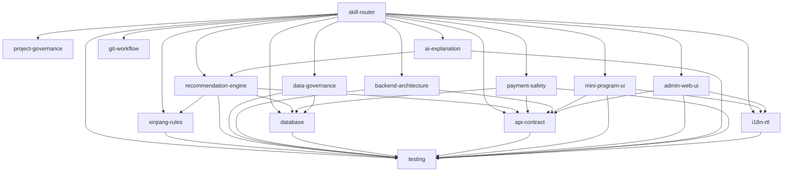

# 新疆高考 AI 志愿助手
# Step 8 — Codex Skills V1.0

- **Status:** COMPLETE
- **Checkpoint A:** PASSED
- **Checkpoint B:** PASSED
- **Purpose:** Convert approved project constraints into task-scoped, executable Codex Skills for multi-session implementation.

---

## 1. Project Baseline Read

### 1.1 Sources requested

The Step 8 design is based on the project SSOT set:

- `docs/00-project-master-context.md`
- `docs/00-decision-register.md`
- `docs/00-progress-tracker.md`
- `docs/00-checkpoint-b-report.md`
- `docs/01-prd.md`
- `docs/02-xinjiang-business-rules.md`
- `docs/03-system-architecture.md`
- `docs/04-database-design.md`
- `docs/05-api-contract.md`
- `docs/06-information-architecture.md`
- `docs/07-ui-specification.md`

### 1.2 Read result

- Directly read in the current execution environment: `00-project-master-context.md`, `00-decision-register.md`, `00-progress-tracker.md`, `00-checkpoint-b-report.md`, `01-prd.md`, `02-xinjiang-business-rules.md`, `03-system-architecture.md`, `04-database-design.md`, `05-api-contract.md`, `07-ui-specification.md`.
- `06-information-architecture.md` was requested but its physical file was not present in the current `/mnt/data` execution directory and file search returned no matching artifact. This is recorded explicitly; no content was fabricated.
- Non-blocking continuity evidence for IA was taken only from the already-passed `00-checkpoint-b-report.md` (including API↔IA and UI↔IA audits) and the route/state mapping embedded in `07-ui-specification.md`.

---

## 2. Conflict Check

### CR-S8-001 — Progress Tracker status drift

- **Severity:** LOW
- **Type:** Governance / Documentation Drift
- **Blocking:** NO
- **Documents:** `00-checkpoint-b-report.md` vs current `00-progress-tracker.md`
- **Finding:** Checkpoint B report states the tracker was upgraded to `Checkpoint-B-Passed-V1`, but the actual tracker file still declares `Step-6-Complete-V1`, Step 7 as next, and Checkpoint B unstarted.
- **Impact:** A new Codex session can re-run completed work or load the wrong phase.
- **Resolution in this Step:** Update tracker truthfully to `Step-8-Complete-V1`, preserving Checkpoint A/B passed and making Step 9 next.

### SR-S8-001 — IA source artifact unavailable in execution directory

- **Severity:** MEDIUM informational source gap
- **Type:** Source availability
- **Blocking:** NO for Step 8
- **Reason:** Checkpoint B already records passed API↔IA and UI↔IA audits; Step 8 does not redesign IA and Skills explicitly forbid inventing or changing core IA.
- **Constraint:** Step 9/10 repository setup must ensure `docs/06-information-architecture.md` exists before Codex implementation sessions rely on it directly.

### Conflict conclusion

```text
BLOCKING_CONFLICTS = 0
NON_BLOCKING_CONFLICTS = 1
SOURCE_AVAILABILITY_WARNINGS = 1
FROZEN_DECISIONS_OVERRIDDEN = 0
OPEN_DECISIONS_CLOSED = 0
```

---

## 3. Skill Boundary Analysis

### 3.1 Boundary principle

Skills are split by **decision ownership and failure mode**, not by document count. No single super Skill owns all project knowledge.

### 3.2 Boundaries

| Boundary | Owner Skill | Explicitly does not own |
|---|---|---|
| SSOT / decisions / conflicts | project-governance | domain implementation |
| Skill selection | skill-router | business truth |
| 新疆 annual rules | xinjiang-rules | ranking algorithm/UI |
| recommendation pipeline | recommendation-engine | policy adjudication/AI prose |
| provenance and DataVersion | data-governance | recommendation scoring |
| Java module structure | backend-architecture | API redesign/domain re-model |
| persistence | database | ER redesign |
| public/admin contract | api-contract | UI navigation redesign |
| Mini Program | mini-program-ui | Admin IA |
| Admin Web | admin-web-ui | Mini Program IA |
| bilingual/RTL | i18n-rtl | policy interpretation |
| AI explanation | ai-explanation | formal recommendation truth |
| payment trust | payment-safety | Gate-0 closure/provider choice |
| verification | testing | redefining expected semantics |
| branches/worktrees | git-workflow | semantic conflict resolution |

---

## 4. Skill Dependency Graph



Dependency arrows mean “normally load/consult this owner when the task crosses that semantic boundary”, not “always load transitive closure.”

---

## 5. Skill Loading Strategy

### 5.1 Default

1. Start with `skill-router`.
2. Load `project-governance` only when semantics/decisions/SSOT/multiple boundaries are involved.
3. Select exactly one primary owner Skill when possible.
4. Add only direct dependencies needed by touched behavior.
5. Add `testing` for executable changes.
6. Add `git-workflow` only for Git/worktree/session handoff work.

### 5.2 Context minimization

- Read only each selected Skill's `Required upstream documents`.
- Within large docs, load relevant sections first; expand only when a referenced invariant requires it.
- Do not paste all SSOT into prompts.
- Carry forward a compact `Skill Selection Record` and `Git Handoff Record`, not entire prior chats.

### 5.3 Rule-drift prevention

- Decision Register is checked before semantic edits.
- Missing Skill is not permission to violate Frozen Decisions.
- Material task pivot triggers re-routing.
- Cross-document contradiction triggers Conflict Report, not local choice.
- Open Decisions remain explicit in outputs and adapters.

---

## 6. Deliverable Structure

```text
step8-codex-skills/
├── 08-codex-skills.md
└── .codex/
    └── skills/
        ├── README.md
        ├── ROUTING.md
        ├── skill-router/SKILL.md
        ├── project-governance/SKILL.md
        ├── backend-architecture/SKILL.md
        ├── database/SKILL.md
        ├── xinjiang-rules/SKILL.md
        ├── recommendation-engine/SKILL.md
        ├── api-contract/SKILL.md
        ├── mini-program-ui/SKILL.md
        ├── admin-web-ui/SKILL.md
        ├── ai-explanation/SKILL.md
        ├── payment-safety/SKILL.md
        ├── i18n-rtl/SKILL.md
        ├── data-governance/SKILL.md
        ├── testing/SKILL.md
        └── git-workflow/SKILL.md
```

---

## 7. Global executable invariants

- Respect every `FROZEN` / `FROZEN FOR P0` / `FROZEN FOR STEP 9` decision in `00-decision-register.md`.
- Keep every Open Decision open unless the human explicitly approves closure.
- `docs/` is SSOT; implementation must not silently redefine product, rules, architecture, database, API, IA, or UI semantics.
- User and Candidate remain separate.
- ExamProfile, EligibilityProfile, and PreferenceProfile remain versioned.
- Eligibility is never reduced to Boolean.
- Recommendation truth unit remains `AdmissionPlanItem`.
- Successful `RecommendationRun` keeps immutable audit semantics and frozen version references.
- Recommendation creation uses `idempotency_key + request_hash`; replay must not double-charge quota.
- Quota uses `QuotaAccount + QuotaLedger`; Membership, Entitlement, and Quota are not collapsed into `user.vip`.
- Payment success is server-confirmed fact, never client assertion.
- User API and Admin API remain separated.
- AI may explain structured facts but may not override Hard Rules.
- No uncalibrated precise admission probability.
- Recommendation Tier (`REACH/MATCH/SAFE/WATCH`) and Risk remain separate concepts.
- Preserve `zh-CN`, `ug-CN`, and RTL behavior.

---

## 8. Acceptance Checklist

- [x] Project Baseline Read completed for all physically available requested sources.
- [x] Missing IA artifact explicitly recorded; no fabricated reading claim.
- [x] Conflict Check completed before Skill generation.
- [x] No blocking conflict found.
- [x] Tracker drift identified and remediated explicitly.
- [x] Skill Boundary Analysis completed.
- [x] Skill Dependency Graph completed.
- [x] Skill Loading Strategy completed.
- [x] Global governance Skill provided.
- [x] Domain Skills provided.
- [x] Coding Skills provided.
- [x] UI Skills provided, with Mini Program/Admin separation.
- [x] Safety Skills provided for AI and payment.
- [x] Testing Skill provided.
- [x] Git/Workflow Skill provided.
- [x] Every Skill contains Purpose, When to use, Inputs, Required upstream documents, Frozen constraints, Procedure, Output contract, Validation checklist, Forbidden actions, Escalation/Conflict handling.
- [x] Router avoids loading all Skills every time.
- [x] Recommendation keeps AdmissionPlanItem grain.
- [x] User/Candidate and profile versioning preserved.
- [x] Eligibility not Booleanized.
- [x] RecommendationRun immutable audit semantics preserved.
- [x] `idempotency_key + request_hash` and QuotaLedger dedupe preserved.
- [x] Payment server-truth boundary preserved.
- [x] Membership/Entitlement/Quota separation preserved.
- [x] `zh-CN` / `ug-CN` / RTL preserved.
- [x] No uncalibrated precise admission probability.
- [x] Tier/Risk separation preserved.
- [x] Step 8 formal artifact written to disk.
- [x] `00-progress-tracker.md` updated to Step 8 complete.

---

## 9. Step 9 Handoff

### Goal

Design and instantiate Codex multi-session execution using the frozen `main / dev / feature/*` strategy plus Branch + Git Worktree.

### Required Step 9 inputs

- This Step 8 Skill package.
- `00-decision-register.md` DR-051/DR-052/DR-053.
- `03-system-architecture.md` repository/worktree sections.
- Updated `00-progress-tracker.md`.
- Full `docs/` SSOT set; specifically restore/verify physical presence of `06-information-architecture.md` before implementation sessions depend on it.

### Step 9 required outputs

1. Session topology and ownership matrix.
2. Branch/worktree naming and creation commands.
3. Per-session Skill Selection Record.
4. File ownership/overlap policy.
5. Dependency and merge order.
6. Handoff template.
7. Conflict escalation protocol.
8. Context-minimization rules.
9. First executable session prompts.
10. Step 10 coding readiness gate.

### Gate

Step 9 must not begin coding product features merely because worktrees exist. It must first prove session boundaries, dependency order, SSOT availability, and merge safety.
