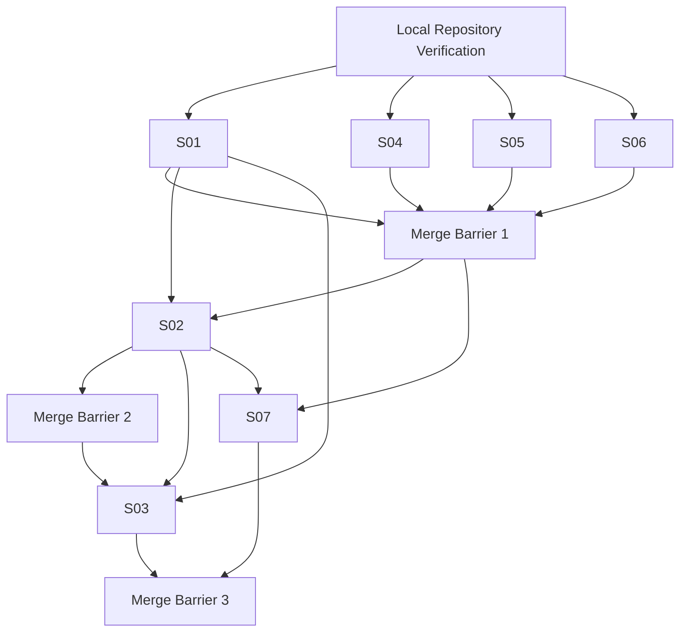

# 新疆高考 AI 志愿助手
# Step 9 — Codex 多会话与编码编排 V1.0

- **建议文件名：** `09-codex-multi-session-orchestration.md`
- **日期：** 2026-07-05
- **阶段：** Step 9
- **状态：** COMPLETE
- **下一阶段：** Step 10 正式编码

## 0. Executive Result

```text
STEP_9 = COMPLETE
BLOCKING_CONFLICTS = 0
PROJECT_SSOT_AVAILABILITY = VERIFIED_IN_CURRENT_EXECUTION_ENVIRONMENT
LOCAL_MAC_REPOSITORY_STATUS = UNVERIFIED
STEP_10_READINESS = CONDITIONAL_PASS
```

`CONDITIONAL_PASS` 的唯一原因不是架构缺失，而是本会话无法直接检查用户 Mac 实时仓库；必须先执行本文给出的非破坏性本地检查。

## A. Step 9 Baseline Read

### A.1 实际读取记录
当前执行环境中已实际检查并读取治理/编排基线：
- `00-project-master-context.md`
- `00-decision-register.md`
- `00-progress-tracker.md`
- `00-checkpoint-b-report.md`
- `08-codex-skills.md`
- `08-codex-skills-bundle.md`
- `ROUTING.md`
- `README.md`

并按领域边界检查正式设计文档的相关章节/目录：
- `01-prd.md`
- `02-xinjiang-business-rules.md`
- `03-system-architecture.md`
- `04-database-design.md`
- `05-api-contract.md`
- `06-information-architecture.md`
- `07-ui-specification.md`

Baseline 结论：`docs/` 为 SSOT；Step 8 Skills 是执行约束层，不反向覆盖冻结设计；最小加载策略有效。

## B. Conflict Check

### B.1 Result
```text
BLOCKING_CONFLICTS = 0
NEW_NON_BLOCKING_CONFLICTS = 0
OPEN_DECISIONS_IMPROPERLY_CLOSED = 0
FROZEN_DECISIONS_OVERRIDDEN = 0
```

### B.2 交叉核验结论
- Decision Register 的 DR-032～DR-053 与 Rules/Architecture/DB/API/IA/UI 的核心边界一致。
- `06-information-architecture.md` 当前真实可读；旧 `SR-S8-001` 只保留为历史记录，不得继续当作当前缺失。
- Checkpoint B 仍为 PASSED；Step 9 不伪造新 Checkpoint。
- OD-001～OD-010 保持 Open/Gate/Policy Reconciliation 状态。
- Step 8 Skill 文档没有获得修改上游 SSOT 的授权。

## C. Project SSOT Availability Check + Repository Verification Plan

### C.1 Project data source availability
15/15 指定文件均在当前执行环境 `/mnt/data` 中 `READABLE`。因此：
```text
PROJECT_SSOT_AVAILABILITY = VERIFIED
IA_SOURCE = AVAILABLE
```

### C.2 Local Mac repository truth classification
```text
LOCAL_MAC_REPOSITORY_STATUS = UNVERIFIED
```
原因：当前会话无权直接读取用户 Mac 上 `My-AI-Code-Project` 的实时 Git 工作树。不得把计划验证写成已验证。完整检查命令见 `worktree-plan.md`。

最低检查集：
```bash
git status --short --branch
git branch --show-current
git branch -a
git remote -v
git worktree list
git log --oneline --decorate -n 10
```
并检查项目目录、`docs/`、`.codex/skills/`、关键 SSOT 文件、未提交修改和已有 worktree。

## D. Session Boundary Analysis

采用 **7 个稳定责任 Session**。理由：少于 7 个会造成 Backend/DB/Recommendation/UI/Safety 写入混杂；更多则会把同一领域切得过碎、增加合并和上下文成本。

| Session | Name | Type | Unique goal | Owner scope |
|---|---|---|---|---|
| S01 | Backend Foundation | Coding/Foundation | 模块化单体与构建基线 | backend foundation/shared/config |
| S02 | Database Phase A | Persistence | Schema Phase A + Flyway | db migration/persistence mapping |
| S03 | Core Recommendation | Domain/Core | 画像版本、Hard Rule、推荐、幂等、Quota | candidate/policy/admission/recommendation core |
| S04 | Mini Program P0 | UI | 小程序 P0 IA/UI | mini-program |
| S05 | Admin Web P0 | UI | Admin IA/UI | admin-web |
| S06 | Data Pipeline Foundation | Offline Data | 来源/版本/质量离线流水线 | data-pipeline |
| S07 | AI & Commerce Safety | Safety/Integration | AI Guard + Payment Mock/server truth | backend ai/commerce |

## E. Session Ownership Matrix

| S01 | Backend Foundation | `feature/backend-foundation` | `../xjgv-wt/backend-foundation` | `backend/` |
| S02 | Database Phase A | `feature/database-phase-a` | `../xjgv-wt/database-phase-a` | `backend/src/main/resources/db/migration/` |
| S03 | Core Recommendation | `feature/recommendation-core` | `../xjgv-wt/recommendation-core` | `backend/src/main/java/com/xjgaokao/{candidate,policy,admission,recommendation,membership}/` |
| S04 | Mini Program P0 | `feature/mini-program-p0` | `../xjgv-wt/mini-program-p0` | `mini-program/` |
| S05 | Admin Web P0 | `feature/admin-web-p0` | `../xjgv-wt/admin-web-p0` | `admin-web/` |
| S06 | Data Pipeline Foundation | `feature/data-pipeline-foundation` | `../xjgv-wt/data-pipeline-foundation` | `data-pipeline/` |
| S07 | AI & Commerce Safety | `feature/ai-commerce-safety` | `../xjgv-wt/ai-commerce-safety` | `backend/src/main/java/com/xjgaokao/{ai,commerce}/` |

Shared SSOT (`docs/**`) is read-only in all implementation sessions. `.codex/skills/**` is read-only unless a separate governance task explicitly owns it. Cross-session overlap is controlled by forbidding writes outside owner scope; shared root build files require an explicit Shared File Request.

### Shared File Request
Before touching root `pom.xml`, package lockfiles, root configs or a file owned by another session, emit:
```yaml
shared_file_request:
  requester: Sxx
  file: path
  reason: ""
  owning_session: Syy|NONE
  proposed_change: ""
  blocking: true|false
```
No silent edits.

## F. Session Dependency Graph



- **并行 Wave 1：** S01, S04, S05, S06。
- **串行关键链：** S01 → S02 → S03。
- **S07：** S01 后可搭骨架；涉及持久化/合同集成部分等待 S02。
- **Merge Barrier：** 后续分支必须从更新后的 `dev` 创建，避免长期漂移。

## G. Parallelization Analysis

可并行的前提是所有会话从同一已验证 dev 基线开始且不写同一 owner 文件。S04/S05 可以使用 API Contract mock，不等待后端实现。S06 不提供在线 API，因此可独立。S02 与 S03 不宜同启：S03 对实体/迁移边界高度依赖 S02。S07 不得提前把 Gate-0 变成真实支付。

## H. Branch / Worktree Strategy

具体分支与目录：
| S01 | Backend Foundation | `feature/backend-foundation` | `../xjgv-wt/backend-foundation` | `backend/` |
| S02 | Database Phase A | `feature/database-phase-a` | `../xjgv-wt/database-phase-a` | `backend/src/main/resources/db/migration/` |
| S03 | Core Recommendation | `feature/recommendation-core` | `../xjgv-wt/recommendation-core` | `backend/src/main/java/com/xjgaokao/{candidate,policy,admission,recommendation,membership}/` |
| S04 | Mini Program P0 | `feature/mini-program-p0` | `../xjgv-wt/mini-program-p0` | `mini-program/` |
| S05 | Admin Web P0 | `feature/admin-web-p0` | `../xjgv-wt/admin-web-p0` | `admin-web/` |
| S06 | Data Pipeline Foundation | `feature/data-pipeline-foundation` | `../xjgv-wt/data-pipeline-foundation` | `data-pipeline/` |
| S07 | AI & Commerce Safety | `feature/ai-commerce-safety` | `../xjgv-wt/ai-commerce-safety` | `backend/src/main/java/com/xjgaokao/{ai,commerce}/` |

创建顺序和 Mac 命令见 `worktree-plan.md`。安全约束：先检查、后创建；发现已有 branch/worktree 停止检查；不执行 `reset --hard`、`clean -fd`、force push。

## I. Per-session Skill Selection Record

每个会话都隐式先使用 `skill-router` 进行选择，但不把 15 个 Skill 全量载入。

| Session | Primary | Supporting | Explicitly Not Loaded | Why |
|---|---|---|---|---|
| S01 | `backend-architecture` | `api-contract`, `testing` | `recommendation-engine`, `mini-program-ui`, `admin-web-ui`, `ai-explanation`, `payment-safety`, `data-governance` | 按任务最小集合，避免加载无关 UI/安全/领域上下文 |
| S02 | `database` | `xinjiang-rules`, `recommendation-engine`, `testing` | `mini-program-ui`, `admin-web-ui`, `ai-explanation`, `payment-safety`, `git-workflow` | 按任务最小集合，避免加载无关 UI/安全/领域上下文 |
| S03 | `recommendation-engine` | `xinjiang-rules`, `backend-architecture`, `database`, `api-contract`, `testing` | `mini-program-ui`, `admin-web-ui`, `ai-explanation`, `payment-safety`, `data-governance` | 按任务最小集合，避免加载无关 UI/安全/领域上下文 |
| S04 | `mini-program-ui` | `api-contract`, `i18n-rtl`, `testing` | `database`, `recommendation-engine`, `admin-web-ui`, `payment-safety`, `data-governance` | 按任务最小集合，避免加载无关 UI/安全/领域上下文 |
| S05 | `admin-web-ui` | `api-contract`, `i18n-rtl`, `testing` | `database`, `recommendation-engine`, `mini-program-ui`, `ai-explanation`, `payment-safety` | 按任务最小集合，避免加载无关 UI/安全/领域上下文 |
| S06 | `data-governance` | `database`, `xinjiang-rules`, `testing` | `mini-program-ui`, `admin-web-ui`, `ai-explanation`, `payment-safety`, `recommendation-engine` | 按任务最小集合，避免加载无关 UI/安全/领域上下文 |
| S07 | `payment-safety` | `ai-explanation`, `api-contract`, `database`, `backend-architecture`, `testing` | `mini-program-ui`, `admin-web-ui`, `data-governance`, `xinjiang-rules` | 按任务最小集合，避免加载无关 UI/安全/领域上下文 |

`git-workflow` 只在创建/合并/交接任务中加载，不因“会话存在于 Git 分支”而自动常驻业务编码上下文。`project-governance` 在出现 SSOT/语义冲突时追加。

## J. Merge Order Analysis

1. `feature/backend-foundation` → `dev`。
2. Wave 1 中 `mini-program-p0`、`admin-web-p0`、`data-pipeline-foundation` 可在各自验证通过后按任意顺序合并，但每次合并后下一个分支先 rebase/merge updated `dev` 并重新测试；不允许语义冲突自动 ours/theirs。
3. Barrier 1 完成后，从最新 `dev` 创建 `feature/database-phase-a`。
4. DB 验证通过后合并 S02 → `dev`，形成 Barrier 2。
5. 从 Barrier 2 创建 `feature/recommendation-core`；S07 从最新可用 dev 开始，持久化相关部分等待 DB。
6. S03 → `dev` 后，再合并/完成 S07，形成 Barrier 3。
7. `main` 只接受经过 dev 集成、测试与人工 review 的阶段性发布；Step 9 不自动执行该合并。

Conflict strategy：文本冲突先识别 ownership；语义冲突查 SSOT；API/DB 冲突禁止本地折中；测试冲突由 owning session + testing 共同分析。

## K. Context Minimization Strategy

- Prompt 只携带 identity、owner scope、必要 SSOT 路径和 Frozen guardrails，不复制全部文档。
- 每次从 `skill-router` 开始，记录 `Skill Selection Record`。
- 大文档先读相关章节，引用到不变量才扩展。
- Session 间只传 `Handoff Record`、commit、contract dependency；不依赖其他聊天历史。
- Material pivot 重新 routing。
- `testing` 只在可执行变更需要时追加；`git-workflow` 只在 Git 操作时追加。

## L. Rule Drift Prevention Strategy

1. 所有实现 Session 的 `docs/**` 默认只读。
2. 语义编辑前查 Decision Register；Open Decision 不得被默认值“偷偷关闭”。
3. Skill 与上游冲突时，上游 SSOT 胜出并输出 Conflict Record。
4. API/DB/IA/UI 需要改变时，停止当前实现，不“顺手修文档”。
5. Changed Files 与 ownership 自动/人工核对。
6. Handoff 必须列出 SSOT assumptions 和 touched decisions。
7. 推荐、支付、AI 三类安全不变量必须有测试或明确 NOT_IMPLEMENTED 记录。

## 9. Handoff Protocol

正式模板见 `handoff-template.md`。最小字段：Session、branch/worktree、base/head commit、Skills、SSOT sections、changed files、tests、API/DB/UI/rule dependencies、Open/Frozen touches、conflicts、merge prerequisites、ready flag。

## 10. Conflict Escalation Protocol

| Type | Trigger | Action | May auto-resolve? |
|---|---|---|---|
| SSOT_CONFLICT | 上游文档矛盾 | 停止语义实现，列文档/章节/影响 | No |
| API_CONFLICT | 实现需要未定义 endpoint/DTO | 停止 contract drift，交给治理/API owner | No |
| DB_CONFLICT | 需要 ER 外字段/关系/语义 | 停止迁移，交给治理/DB owner | No |
| UI_OWNERSHIP_CONFLICT | 两 UI/共享文件写入重叠 | owner 优先，Shared File Request | No |
| RULE_CONFLICT | 新疆政策/Hard Rule 不一致 | 保留 PolicyConflict/Open 状态 | No |
| GIT_CONFLICT | branch/worktree/dirty state 不明 | 停止破坏性操作，先验证 | No |
| TEST_CONFLICT | 测试期望与 SSOT 不一致 | 测试不得重定义业务真值 | No |

## 11. First Codex Session Prompts

完整可复制 Prompt 已落盘：
- `codex-session-prompts/session-foundation.md`
- `codex-session-prompts/session-database-core.md`
- `codex-session-prompts/session-recommendation-core.md`
- `codex-session-prompts/session-mini-program-p0.md`
- `codex-session-prompts/session-admin-web-p0.md`
- `codex-session-prompts/session-data-pipeline.md`
- `codex-session-prompts/session-ai-commerce-safety.md`

每个均包含 identity、objective、owned/read-only/forbidden scope、Skills、upstream docs、Frozen constraints、procedure、validation、Git rules、output contract、handoff、stop/escalation。

## 12. Step 10 Coding Readiness Gate

```text
CURRENT_GATE = CONDITIONAL_PASS
```

### PASS 条件
- Project SSOT availability verified — 已满足。
- Blocking conflicts = 0 — 已满足。
- Step 9 artifacts written — 已满足。
- Progress tracker updated — 已满足。
- 用户本地仓库非破坏性检查全部完成，`dev`/remote/worktree/dirty state 明确 — **待用户本地执行**。
- Repository 中 `docs/06-information-architecture.md` 与 `.codex/skills/**` 物理存在 — **待用户本地执行**。
- 首批 worktree 创建成功且 branch identity 正确 — **待用户本地执行**。

只要本地检查失败，Gate = FAIL，先修复仓库状态；不得继续编码掩盖问题。

## 13. Acceptance Checklist — evidence based

- [x] Baseline Read completed — 实际读取治理基线与领域关键章节。
- [x] Conflict Check completed — 0 blocking conflicts。
- [x] Project SSOT availability verified — 15/15 readable；IA 已验证可用。
- [x] Repository status truthfully classified — `UNVERIFIED`，未伪称读取 Mac。
- [x] Session topology complete — 7 sessions。
- [x] Ownership matrix complete — owner branch/worktree/path 已明确。
- [x] File overlap controlled — owner-only + Shared File Request。
- [x] Branch names concrete — 全部 `feature/*`。
- [x] Worktree plan executable on Mac — 已给检查/创建/清理命令。
- [x] Skill selection recorded per session — Primary + Supporting。
- [x] Explicitly not loaded skills recorded — 每 Session 已列。
- [x] Dependency graph complete — 含 3 barriers。
- [x] Parallelization boundaries clear — Wave 1 和关键链明确。
- [x] Merge order complete — feature → dev 顺序明确。
- [x] Handoff protocol complete — 标准 YAML 模板。
- [x] Conflict escalation protocol complete — 7 类冲突。
- [x] Context minimization strategy complete — router/selection/handoff/no chat dependency。
- [x] Rule drift prevention strategy complete — SSOT read-only/stop rules。
- [x] First Codex prompts fully executable — 7 个完整 Prompt 已落盘。
- [x] Step 10 readiness gate defined — Conditional Pass + explicit conditions。
- [x] Formal files written to disk — 本文 + prompts + worktree + handoff。
- [x] Progress tracker updated — Step 9 COMPLETE / Step 10 NEXT。

## 14. Step 10 Handoff

### First launch wave
1. S01 Backend Foundation — `codex-session-prompts/session-foundation.md` — `feature/backend-foundation` — `../xjgv-wt/backend-foundation`.
2. S04 Mini Program P0 — `session-mini-program-p0.md` — `feature/mini-program-p0` — `../xjgv-wt/mini-program-p0`.
3. S05 Admin Web P0 — `session-admin-web-p0.md` — `feature/admin-web-p0` — `../xjgv-wt/admin-web-p0`.
4. S06 Data Pipeline Foundation — `session-data-pipeline.md` — `feature/data-pipeline-foundation` — `../xjgv-wt/data-pipeline-foundation`.

These four may run in parallel **after local verification**.

### Skills
- S01: backend-architecture + api-contract + testing.
- S04: mini-program-ui + api-contract + i18n-rtl + testing.
- S05: admin-web-ui + api-contract + i18n-rtl + testing.
- S06: data-governance + database + xinjiang-rules + testing.
All start with skill-router; project-governance added on conflict only.

### Forbidden writes
- All: `docs/**`, other Session owner dirs, `.codex/skills/**`.
- S04 may not edit Admin; S05 may not edit Mini Program.
- S06 may not expose online API.
- S01 may not implement recommendation policy/algorithm or close Open Decisions.

### First Merge Barrier
Barrier 1 requires S01 merged first; S04/S05/S06 each revalidate against updated dev before merge. After Barrier 1 create S02 from latest dev. After S02 merge, create S03. S07 can begin skeleton after Barrier 1 but DB-coupled work waits for Barrier 2.

### User local actions before coding
Run all commands in `worktree-plan.md`, confirm repository root, current branch, remotes, dirty files, existing worktrees, `docs/**`, `.codex/skills/**`, and specifically `docs/06-information-architecture.md`. Only then create first-wave worktrees.
